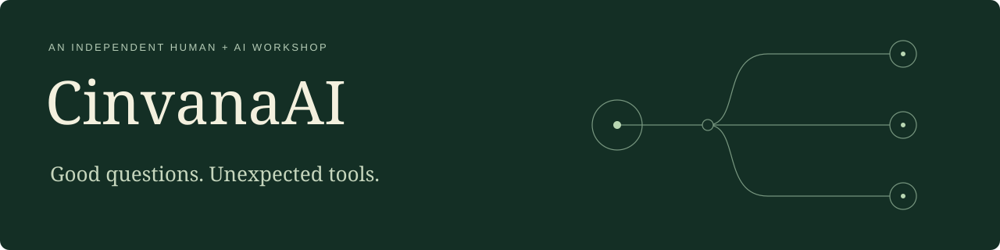

We follow an idea until it becomes something you can explore, use, or build on. Sometimes that means a whole system. Sometimes the interesting detour becomes a project of its own.

**[Browse the interactive collection](https://cinvanaai.github.io/lab-portfolio/)** — search by what you want to do, inspect a representative result, and follow it into the source.

The work combines human ideas, direction, and judgment with AI-assisted implementation. It includes tools, libraries, workbenches, experiments, and a design method. Each package explains what is implemented, supplies a worked example, and states its limits and reuse terms.

## Explore the work

Everything below has the same place in the collection. This directory is alphabetical; a project’s size or origin does not make it more important than another.

| Project | What you can do with it | Example and source guide |
|---|---|---|
| [Agent Assembly Runtime](https://github.com/CinvanaAI/agent-assembly-runtime) | Keep an authored agent/task definition as one canonical document while exposing inspectable group, task, and memory files. | [Explore](https://cinvanaai.github.io/lab-portfolio/projects/agent-assembly-runtime.html) |
| [Agent Chatroom Ledger](https://github.com/CinvanaAI/agent-chatroom-ledger) | Maintain a durable coordination room whose participants and independent consumers can resume reading after restart. | [Explore](https://cinvanaai.github.io/lab-portfolio/projects/agent-chatroom-ledger.html) |
| [Agent Foundry Blueprint Compiler](https://github.com/CinvanaAI/agent-foundry-blueprint-compiler) | Turn a capability record into an inspectable fenced blueprint, parse it back, and detect malformed package boundaries. | [Explore](https://cinvanaai.github.io/lab-portfolio/projects/agent-foundry-blueprint-compiler.html) |
| [Agent Workflow Governance](https://github.com/CinvanaAI/agent-workflow-governance) | Configure an agent workflow, constrain approved package/action pairs, and reject unapproved execution requests. | [Explore](https://cinvanaai.github.io/lab-portfolio/projects/agent-workflow-governance.html) |
| [AI Software Factory Prototype](https://github.com/CinvanaAI/ai-software-factory-prototype) | Study and adapt a two-stage code-generation pipeline that keeps the first output, refined output and job evidence separate. | [Explore](https://cinvanaai.github.io/lab-portfolio/projects/ai-software-factory-prototype.html) |
| [Alias Resolver](https://github.com/CinvanaAI/alias-resolver) | Use one reviewed configuration to resolve project paths, Python imports, modules, and application lifecycle calls. | [Explore](https://cinvanaai.github.io/lab-portfolio/projects/alias-resolver.html) |
| [Architecture Difference Case Study](https://github.com/CinvanaAI/architecture-difference-case-study) | Examine how two implementations deliver the same transformation while distributing responsibility differently. | [Explore](https://cinvanaai.github.io/lab-portfolio/projects/architecture-difference-case-study.html) |
| [Astra-l-Projection](https://github.com/CinvanaAI/Astra-l-Projection) | Connect a conversation to a body, camera, and bounded movement in your own Unreal world. | [Explore](https://cinvanaai.github.io/lab-portfolio/projects/Astra-l-Projection.html) |
| [Atlas Domain Pack SDK](https://github.com/CinvanaAI/atlas-domain-pack-sdk) | Author an Atlas domain pack and catch malformed definitions or cross-file references before loading a database. | [Explore](https://cinvanaai.github.io/lab-portfolio/projects/atlas-domain-pack-sdk.html) |
| [Atlas Kernel](https://github.com/CinvanaAI/atlas-kernel) | Turn source evidence into explicit work packets, review candidate graph additions, and retain accepted nodes, edges, and commit evidence. | [Explore](https://cinvanaai.github.io/lab-portfolio/projects/atlas-kernel.html) |
| [Bounded Execution Ledger](https://github.com/CinvanaAI/bounded-execution-ledger) | Run a bounded unit of work and keep a durable envelope, response, artifact references and human-readable log together. | [Explore](https://cinvanaai.github.io/lab-portfolio/projects/bounded-execution-ledger.html) |
| [Builder Prototypes](https://github.com/CinvanaAI/builder-prototypes) | Study and adapt a compact request-to-prompt-to-registered-step pipeline from an early software-builder experiment. | [Explore](https://cinvanaai.github.io/lab-portfolio/projects/builder-prototypes.html) |
| [Capability Graph Importer](https://github.com/CinvanaAI/capability-graph-importer) | Turn capability-package JSON or Foundry blueprint text into an inspectable graph plan before a database import. | [Explore](https://cinvanaai.github.io/lab-portfolio/projects/capability-graph-importer.html) |
| [Capability Package Workbench](https://github.com/CinvanaAI/capability-package-workbench) | Define a versioned capability package, inspect and publish a snapshot, then run an action against that published version. | [Explore](https://cinvanaai.github.io/lab-portfolio/projects/capability-package-workbench.html) |
| [ChatGPT Export Archive and Migration Toolkit](https://github.com/CinvanaAI/chatgpt-export-to-conversation-engine) | Preserve exported conversations, distinguish true duplicates from same-ID variants, inspect each message, and optionally prepare bounded Conversation Engine batches. | [Explore](https://cinvanaai.github.io/lab-portfolio/projects/chatgpt-export-to-conversation-engine.html) |
| [Codex Judge Loop](https://github.com/CinvanaAI/codex-judge-loop) | Run one bounded coding strategy/review/implementation/review cycle and retain exactly what each phase did. | [Explore](https://cinvanaai.github.io/lab-portfolio/projects/codex-judge-loop.html) |
| [Codex Session Transcript Exporter](https://github.com/CinvanaAI/codex-session-transcript-exporter) | Export a chosen coding conversation into readable messages and a provenance ledger without copying every internal event. | [Explore](https://cinvanaai.github.io/lab-portfolio/projects/codex-session-transcript-exporter.html) |
| [Conversation Archive for Discord](https://github.com/CinvanaAI/cinvana-discord-engine) | Turn a local conversation collection into an ordered Discord archive and preview the exact changes before sending them. | [Explore](https://cinvanaai.github.io/lab-portfolio/projects/cinvana-discord-engine.html) |
| [Conversation Engine](https://github.com/CinvanaAI/cinvana-conversation-engine) | Keep a conversation source and its evolving transformations consistent, traceable, and recoverable in a local vault. | [Explore](https://cinvanaai.github.io/lab-portfolio/projects/cinvana-conversation-engine.html) |
| [Conversation Target Tagger](https://github.com/CinvanaAI/conversation-target-tagger) | Label who or what exported messages concern while preserving chronological identity and enough context to resolve references. | [Explore](https://cinvanaai.github.io/lab-portfolio/projects/conversation-target-tagger.html) |
| [D&D 5e Graph ETL](https://github.com/CinvanaAI/dnd5e-graph-etl) | Prepare versioned rules JSON as provenance-bearing records and explicit reference relationships for a graph import. | [Explore](https://cinvanaai.github.io/lab-portfolio/projects/dnd5e-graph-etl.html) |
| [DeckScope](https://github.com/CinvanaAI/DeckScope) | Inspect the evidence behind a document's claims and leave with explicit unknowns and next questions. | [Explore](https://cinvanaai.github.io/lab-portfolio/projects/DeckScope.html) |
| [Dice Expression Extractor](https://github.com/CinvanaAI/dice-expression-extractor) | Find mechanical dice expressions inside structured JSON while preserving the field and action that gave each expression meaning. | [Explore](https://cinvanaai.github.io/lab-portfolio/projects/dice-expression-extractor.html) |
| [Discord Activity Privacy Core](https://github.com/CinvanaAI/discord-activity-privacy-core) | Decide whether an activity event may be retained and produce a minimized record under an explicit consent/retention policy. | [Explore](https://cinvanaai.github.io/lab-portfolio/projects/discord-activity-privacy-core.html) |
| [Discord Topology Reconciler](https://github.com/CinvanaAI/discord-topology-reconciler) | Plan the writes needed to align an existing ordered message stream with a new desired stream while retaining physical slots and pending-operation identity. | [Explore](https://cinvanaai.github.io/lab-portfolio/projects/discord-topology-reconciler.html) |
| [Evidence Archive Museum](https://github.com/CinvanaAI/evidence-archive-museum) | Turn a small structured archive into a portable searchable HTML exhibition while checking its references and counts. | [Explore](https://cinvanaai.github.io/lab-portfolio/projects/evidence-archive-museum.html) |
| [Fungus Observability](https://github.com/CinvanaAI/fungus-observability) | Observe selected Python calls with opt-in local event capture while avoiding payload collection by default. | [Explore](https://cinvanaai.github.io/lab-portfolio/projects/fungus-observability.html) |
| [GitHub Project Draft Publisher](https://github.com/CinvanaAI/github-projects-v2-draft-publisher) | Review a structured work plan, then deliberately create a GitHub Project and draft items from it. | [Explore](https://cinvanaai.github.io/lab-portfolio/projects/github-projects-v2-draft-publisher.html) |
| [Governed Change Workbench](https://github.com/CinvanaAI/governed-change-workbench) | Record a change request through explicit implementation, review, audit and synthesis stages with frozen inputs and durable records. | [Explore](https://cinvanaai.github.io/lab-portfolio/projects/governed-change-workbench.html) |
| [Manifest File Relocator](https://github.com/CinvanaAI/manifest-file-relocator) | Preview, execute and undo an organized file move while checking that the reviewed files have not changed. | [Explore](https://cinvanaai.github.io/lab-portfolio/projects/manifest-file-relocator.html) |
| [Materialized Task Runner](https://github.com/CinvanaAI/materialized-task-runner) | Run a saved trusted Python task definition in a fresh interpreter and retain the input/output/source evidence. | [Explore](https://cinvanaai.github.io/lab-portfolio/projects/materialized-task-runner.html) |
| [Message Version Bundle Builder](https://github.com/CinvanaAI/message-version-bundle-builder) | Package a canonical message and nine reviewed context versions into a strict, verifiable bundle. | [Explore](https://cinvanaai.github.io/lab-portfolio/projects/message-version-bundle-builder.html) |
| [Model Provider Compatibility Lab](https://github.com/CinvanaAI/model-provider-compatibility-lab) | Record what a specific model/provider route actually did for a particular task and distinguish unsupported behavior from fixable configuration. | [Explore](https://cinvanaai.github.io/lab-portfolio/projects/model-provider-compatibility-lab.html) |
| [Mortal Kombat](https://github.com/CinvanaAI/mortal-kombat) | Compare candidate models on a task, inspect why each response won or failed, and view cost estimates grounded in returned usage. | [Explore](https://cinvanaai.github.io/lab-portfolio/projects/mortal-kombat.html) |
| [Persistent Discord RPG](https://github.com/CinvanaAI/persistent-discord-rpg) | Run campaigns and character-creation conversations that survive a Discord bot restart. | [Explore](https://cinvanaai.github.io/lab-portfolio/projects/persistent-discord-rpg.html) |
| [Persistent Interaction State](https://github.com/CinvanaAI/persistent-discord-state-machine) | Resume multi-step user workflows after a restart and reject stale updates. | [Explore](https://cinvanaai.github.io/lab-portfolio/projects/persistent-discord-state-machine.html) |
| [Personal Intelligence Dashboard](https://github.com/CinvanaAI/personal-intelligence-dashboard) | Explore a forward-looking personal-information dashboard and safely census explicitly chosen local sources. | [Explore](https://cinvanaai.github.io/lab-portfolio/projects/personal-intelligence-dashboard.html) |
| [Project Blueprint Agent Team](https://github.com/CinvanaAI/project-blueprint-agent-team) | Adapt a staged process that turns a project request into architectural notes, dependencies and per-file implementation prompts. | [Explore](https://cinvanaai.github.io/lab-portfolio/projects/project-blueprint-agent-team.html) |
| [Provenance Inventory](https://github.com/CinvanaAI/provenance-inventory) | Establish what files exist and which are byte-identical before deciding how to migrate, deduplicate, or index an archive. | [Explore](https://cinvanaai.github.io/lab-portfolio/projects/provenance-inventory.html) |
| [Python Agent Foundry Workbench](https://github.com/CinvanaAI/python-agent-foundry-workbench) | Author Python capability packages, assemble task definitions and manage explicit local agent/workflow records in a desktop workbench. | [Explore](https://cinvanaai.github.io/lab-portfolio/projects/python-agent-foundry-workbench.html) |
| [Python Function Structure Comparator](https://github.com/CinvanaAI/python-function-structure-comparator) | Compare Python functions or rank likely variants using syntax, signature, calls, and literals without importing or executing target code. | [Explore](https://cinvanaai.github.io/lab-portfolio/projects/python-function-structure-comparator.html) |
| [RevEng](https://github.com/CinvanaAI/RevEng) | Inspect an unfamiliar Python repository and get source-linked structural maps, reports and explicit unknowns. | [Explore](https://cinvanaai.github.io/lab-portfolio/projects/RevEng.html) |
| [RPG Character Rules](https://github.com/CinvanaAI/rpg-character-rules-engine) | Create and validate character-sheet data without running a Discord bot. | [Explore](https://cinvanaai.github.io/lab-portfolio/projects/rpg-character-rules-engine.html) |
| [Safe Gitignore Builder](https://github.com/CinvanaAI/safe-gitignore-builder) | Review a messy source tree and generate an allowlist-style ignore candidate that exposes only explicitly approved files. | [Explore](https://cinvanaai.github.io/lab-portfolio/projects/safe-gitignore-builder.html) |
| [Skeleton](https://github.com/CinvanaAI/Skeleton) | Explore a local TypeScript workbench for capability package versions, agent workflow policies and inspectable execution records. | [Explore](https://cinvanaai.github.io/lab-portfolio/projects/skeleton.html) |
| [The Seven Ownership Architecture](https://github.com/CinvanaAI/seven-ownership-architecture) | Apply an ownership-boundary review to a software system and separate what it is, what exists and where it may go next. | [Explore](https://cinvanaai.github.io/lab-portfolio/projects/seven-ownership-architecture.html) |
| [Transcript Model Evaluator](https://github.com/CinvanaAI/transcript-model-evaluator) | Examine how prompt-owned assets, provider attempts, rankings, model records and pricing views were brought into one desktop workflow. | [Explore](https://cinvanaai.github.io/lab-portfolio/projects/transcript-model-evaluator.html) |
| [Transcript to GitHub Projects](https://github.com/CinvanaAI/transcript-to-github-projects) | Explore an early local workflow for extracting planning material from a transcript and reviewing model outputs before publication. | [Explore](https://cinvanaai.github.io/lab-portfolio/projects/transcript-to-github-projects.html) |
| [Usage Capture](https://github.com/CinvanaAI/usage-capture) | Turn a visible usage display into local, inspectable values with separately preserved Codex and Ollama adapters. | [Explore](https://cinvanaai.github.io/lab-portfolio/projects/usage-capture.html) |
| [Verified Completion Kernel](https://github.com/CinvanaAI/verified-completion-kernel) | Evaluate an operation’s artifacts against explicit completion rules and retain a structured result/resume record when verification is incomplete. | [Explore](https://cinvanaai.github.io/lab-portfolio/projects/verified-completion-kernel.html) |

Start wherever your curiosity takes you. The examples are there to make the work inspectable, and each repository is open for concrete questions and improvements under its stated license.
